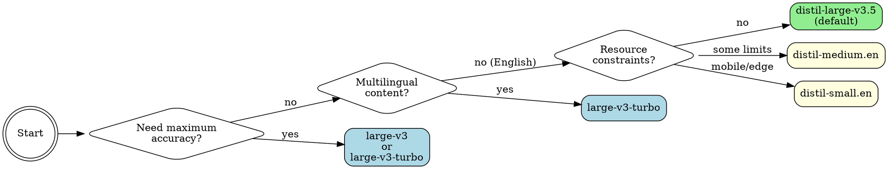

# Faster Whisper

Local speech-to-text using faster-whisper — a CTranslate2 reimplementation of OpenAI's Whisper that runs **4-6x faster** with identical accuracy. With GPU acceleration, expect **~20x realtime** transcription (a 10-minute audio file in ~30 seconds).

## When to Use

Use this skill when you need to:
- **Transcribe audio/video files** — meetings, interviews, podcasts, lectures, YouTube videos
- **Generate subtitles** — SRT and VTT output with word-level timestamps
- **Identify speakers** — diarization labels who said what (`--diarize`)
- **Transcribe from URLs** — YouTube links and direct audio URLs (auto-downloads via yt-dlp)
- **Batch process files** — glob patterns, directories, skip-existing support
- **Convert speech to text locally** — no API costs, works offline (after model download)
- **Multilingual transcription** — supports 99+ languages with auto-detection
- **Prime for domain terms** — use `--initial-prompt` for jargon-heavy content

**Trigger phrases:** "transcribe this audio", "convert speech to text", "what did they say", "make a transcript", "audio to text", "subtitle this video", "who's speaking"

**⚠️ Agent guidance — keep invocations minimal:**
- Default command (`./scripts/transcribe audio.mp3`) is the fastest path — don't add flags the user didn't ask for
- Only add `--diarize` if the user asks "who said what" / "identify speakers"
- Only add `--format srt/vtt` if the user asks for subtitles/captions
- Only add `--word-timestamps` if the user needs word-level timing
- Only add `--initial-prompt` if there's domain-specific jargon to prime
- Any word-level feature auto-runs wav2vec2 alignment (~5-10s overhead)
- `--diarize` adds ~20-30s on top of that

**When NOT to use:**
- Real-time/streaming transcription (use streaming-optimized tools instead)
- Cloud-only environments without local compute
- Files <10 seconds where API call latency doesn't matter

## Quick Reference

| Task | Command | Notes |
|------|---------|-------|
| **Basic transcription** | `./scripts/transcribe audio.mp3` | Batched inference, VAD on, distil-large-v3.5 |
| **SRT subtitles** | `./scripts/transcribe audio.mp3 --format srt -o subs.srt` | Word timestamps auto-enabled |
| **VTT subtitles** | `./scripts/transcribe audio.mp3 --format vtt -o subs.vtt` | WebVTT format |
| **Word timestamps** | `./scripts/transcribe audio.mp3 --word-timestamps --format srt` | wav2vec2 aligned (~10ms) |
| **Speaker diarization** | `./scripts/transcribe audio.mp3 --diarize` | Requires pyannote.audio |
| **YouTube/URL** | `./scripts/transcribe https://youtube.com/watch?v=...` | Auto-downloads via yt-dlp |
| **Batch process** | `./scripts/transcribe *.mp3 -o ./transcripts/` | Output to directory |
| **Batch with skip** | `./scripts/transcribe *.mp3 --skip-existing -o ./out/` | Resume interrupted batches |
| **Domain terms** | `./scripts/transcribe audio.mp3 --initial-prompt 'Kubernetes gRPC'` | Boost rare terminology |
| **Faster English** | `./scripts/transcribe audio.mp3 --model distil-medium.en -l en` | English-only, 6.8x faster |
| **Maximum accuracy** | `./scripts/transcribe audio.mp3 --model large-v3 --beam-size 10` | Full model |
| **JSON output** | `./scripts/transcribe audio.mp3 --format json -o out.json` | Programmatic access with stats |
| **Filter noise** | `./scripts/transcribe audio.mp3 --min-confidence 0.6` | Drop low-confidence segments |
| **Reduce batch size** | `./scripts/transcribe audio.mp3 --batch-size 4` | If OOM on GPU |

## Model Selection

Choose the right model for your needs:



### Model Table

#### Standard Models (Full Whisper)
| Model | Size | Speed | Accuracy | Use Case |
|-------|------|-------|----------|----------|
| `tiny` / `tiny.en` | 39M | Fastest | Basic | Quick drafts |
| `base` / `base.en` | 74M | Very fast | Good | General use |
| `small` / `small.en` | 244M | Fast | Better | Most tasks |
| `medium` / `medium.en` | 769M | Moderate | High | Quality transcription |
| `large-v1/v2/v3` | 1.5GB | Slower | Best | Maximum accuracy |
| `large-v3-turbo` | 809M | Fast | Excellent | High accuracy (slower than distil) |

#### Distilled Models (~6x Faster, ~1% WER difference)
| Model | Size | Speed vs Standard | Accuracy | Use Case |
|-------|------|-------------------|----------|----------|
| **`distil-large-v3.5`** | 756M | ~6.3x faster | 7.08% WER | **Default, best balance** |
| `distil-large-v3` | 756M | ~6.3x faster | 7.53% WER | Previous default |
| `distil-large-v2` | 756M | ~5.8x faster | 10.1% WER | Fallback |
| `distil-medium.en` | 394M | ~6.8x faster | 11.1% WER | English-only, resource-constrained |
| `distil-small.en` | 166M | ~5.6x faster | 12.1% WER | Mobile/edge devices |

`.en` models are English-only and slightly faster/better for English content.

## Setup

### Linux / macOS / WSL2
```bash
# Base install (creates venv, installs deps, auto-detects GPU)
./setup.sh

# With speaker diarization support
./setup.sh --diarize
```

Requirements:
- Python 3.10+, ffmpeg
- Optional: yt-dlp (for URL/YouTube input)
- Optional: pyannote.audio (for `--diarize`, installed via `setup.sh --diarize`)

### Platform Support

| Platform | Acceleration | Speed |
|----------|-------------|-------|
| **Linux + NVIDIA GPU** | CUDA | ~20x realtime 🚀 |
| **WSL2 + NVIDIA GPU** | CUDA | ~20x realtime 🚀 |
| macOS Apple Silicon | CPU* | ~3-5x realtime |
| macOS Intel | CPU | ~1-2x realtime |
| Linux (no GPU) | CPU | ~1x realtime |

*faster-whisper uses CTranslate2 which is CPU-only on macOS, but Apple Silicon is fast enough for practical use.

### GPU Support (IMPORTANT!)

The setup script auto-detects your GPU and installs PyTorch with CUDA. **Always use GPU if available** — CPU transcription is extremely slow.

| Hardware | Speed | 9-min video |
|----------|-------|-------------|
| RTX 3070 (GPU) | ~20x realtime | ~27 sec |
| CPU (int8) | ~0.3x realtime | ~30 min |

If setup didn't detect your GPU, manually install PyTorch with CUDA:

```bash
# For CUDA 12.x
uv pip install --python .venv/bin/python torch --index-url https://download.pytorch.org/whl/cu121

# For CUDA 11.x
uv pip install --python .venv/bin/python torch --index-url https://download.pytorch.org/whl/cu118
```

- **WSL2 users**: Ensure you have the [NVIDIA CUDA drivers for WSL](https://docs.nvidia.com/cuda/wsl-user-guide/) installed on Windows

## Usage

```bash
# Basic transcription
./scripts/transcribe audio.mp3

# SRT subtitles
./scripts/transcribe audio.mp3 --format srt -o subtitles.srt

# WebVTT subtitles
./scripts/transcribe audio.mp3 --format vtt -o subtitles.vtt

# Transcribe from YouTube URL
./scripts/transcribe https://youtube.com/watch?v=dQw4w9WgXcQ --language en

# Speaker diarization
./scripts/transcribe meeting.wav --diarize

# Diarized VTT subtitles
./scripts/transcribe meeting.wav --diarize --format vtt -o meeting.vtt

# Prime with domain terminology
./scripts/transcribe lecture.mp3 --initial-prompt "Kubernetes, gRPC, PostgreSQL, NGINX"

# Batch process a directory
./scripts/transcribe ./recordings/ -o ./transcripts/

# Batch with glob, skip already-done files
./scripts/transcribe *.mp3 --skip-existing -o ./transcripts/

# Filter low-confidence segments
./scripts/transcribe noisy-audio.mp3 --min-confidence 0.6

# JSON output with full metadata
./scripts/transcribe audio.mp3 --format json -o result.json

# Specify language (faster than auto-detect)
./scripts/transcribe audio.mp3 --language en
```

## Options

```
Input:
  AUDIO                 Audio file(s), directory, glob pattern, or URL
                        Accepts: mp3, wav, m4a, flac, ogg, webm, mp4, mkv, avi, wma, aac
                        URLs auto-download via yt-dlp (YouTube, direct links, etc.)

Model & Language:
  -m, --model NAME      Whisper model (default: distil-large-v3.5)
  -l, --language CODE   Language code, e.g. en, es, fr (auto-detects if omitted)
  --initial-prompt TEXT  Prompt to condition the model (terminology, formatting style)
  --hotwords WORDS      Space-separated hotwords to boost recognition

Output Format:
  -f, --format FMT      text | json | srt | vtt (default: text)
  --word-timestamps     Include word-level timestamps (wav2vec2 aligned automatically)
  -o, --output PATH     Output file or directory (directory for batch mode)

Inference Tuning:
  --beam-size N         Beam search size; higher = more accurate but slower (default: 5)
  --batch-size N        Batched inference batch size (default: 8; reduce if OOM)
  --no-vad              Disable voice activity detection (on by default)
  --no-batch            Disable batched inference (use standard WhisperModel)

Advanced:
  --diarize             Speaker diarization (requires pyannote.audio)
  --min-confidence PROB Filter segments below this avg word confidence (0.0–1.0)
  --skip-existing       Skip files whose output already exists (batch mode)

Device:
  --device DEV          auto | cpu | cuda (default: auto)
  --compute-type TYPE   auto | int8 | float16 | float32 (default: auto)
  -q, --quiet           Suppress progress and status messages
```

## Output Formats

### Text (default)
Plain transcript text. With `--diarize`, speaker labels are inserted:
```
[SPEAKER_1]
 Hello, welcome to the meeting.
[SPEAKER_2]
 Thanks for having me.
```

### JSON (`--format json`)
Full metadata including segments, timestamps, language detection, and performance stats:
```json
{
  "file": "audio.mp3",
  "text": "Hello, welcome...",
  "language": "en",
  "language_probability": 0.98,
  "duration": 600.5,
  "segments": [...],
  "speakers": ["SPEAKER_1", "SPEAKER_2"],
  "stats": {
    "processing_time": 28.3,
    "realtime_factor": 21.2
  }
}
```

### SRT (`--format srt`)
Standard subtitle format for video players:
```
1
00:00:00,000 --> 00:00:02,500
[SPEAKER_1] Hello, welcome to the meeting.

2
00:00:02,800 --> 00:00:04,200
[SPEAKER_2] Thanks for having me.
```

### VTT (`--format vtt`)
WebVTT format for web video players:
```
WEBVTT

1
00:00:00.000 --> 00:00:02.500
[SPEAKER_1] Hello, welcome to the meeting.

2
00:00:02.800 --> 00:00:04.200
[SPEAKER_2] Thanks for having me.
```

## Speaker Diarization

Identifies who spoke when using [pyannote.audio](https://github.com/pyannote/pyannote-audio).

**Setup:**
```bash
./setup.sh --diarize
```

**Requirements:**
- HuggingFace token at `~/.cache/huggingface/token` (`huggingface-cli login`)
- Accepted model agreements:
  - https://hf.co/pyannote/speaker-diarization-3.1
  - https://hf.co/pyannote/segmentation-3.0

**Usage:**
```bash
# Basic diarization (text output)
./scripts/transcribe meeting.wav --diarize

# Diarized subtitles
./scripts/transcribe meeting.wav --diarize --format srt -o meeting.srt

# Diarized JSON (includes speakers list)
./scripts/transcribe meeting.wav --diarize --format json
```

Speakers are labeled `SPEAKER_1`, `SPEAKER_2`, etc. in order of first appearance. Diarization runs on GPU automatically if CUDA is available.

## Precise Word Timestamps

Whenever word-level timestamps are computed (`--word-timestamps`, `--diarize`, or `--min-confidence`), a wav2vec2 forced alignment pass automatically refines them from Whisper's ~100-200ms accuracy to ~10ms. No extra flag needed.

```bash
# Word timestamps with automatic wav2vec2 alignment
./scripts/transcribe audio.mp3 --word-timestamps --format json

# Diarization also gets precise alignment automatically
./scripts/transcribe meeting.wav --diarize

# Precise subtitles
./scripts/transcribe audio.mp3 --word-timestamps --format srt -o subtitles.srt
```

Uses the MMS (Massively Multilingual Speech) model from torchaudio — supports 1000+ languages. The model is cached after first load, so batch processing stays fast.

## URL & YouTube Input

Pass any URL as input — audio is downloaded automatically via yt-dlp:

```bash
# YouTube video
./scripts/transcribe https://youtube.com/watch?v=dQw4w9WgXcQ

# Direct audio URL
./scripts/transcribe https://example.com/podcast.mp3

# With options
./scripts/transcribe https://youtube.com/watch?v=... --language en --format srt -o subs.srt
```

Requires `yt-dlp` (checks PATH and `~/.local/share/pipx/venvs/yt-dlp/bin/yt-dlp`).

## Batch Processing

Process multiple files at once with glob patterns, directories, or multiple paths:

```bash
# All MP3s in current directory
./scripts/transcribe *.mp3

# Entire directory (auto-filters audio files)
./scripts/transcribe ./recordings/

# Output to directory (one file per input)
./scripts/transcribe *.mp3 -o ./transcripts/

# Skip already-transcribed files (resume interrupted batch)
./scripts/transcribe *.mp3 --skip-existing -o ./transcripts/

# Mixed inputs
./scripts/transcribe file1.mp3 file2.wav ./more-recordings/

# Batch SRT subtitles
./scripts/transcribe *.mp3 --format srt -o ./subtitles/
```

When outputting to a directory, files are named `{input-stem}.{ext}` (e.g., `audio.mp3` → `audio.srt`).

Batch mode prints a summary after all files complete:
```
📊 Done: 12 files, 3h24m audio in 10m15s (19.9× realtime)
```

## Common Mistakes

| Mistake | Problem | Solution |
|---------|---------|----------|
| **Using CPU when GPU available** | 10-20x slower transcription | Check `nvidia-smi`; verify CUDA installation |
| **Not specifying language** | Wastes time auto-detecting on known content | Use `--language en` when you know the language |
| **Using wrong model** | Unnecessary slowness or poor accuracy | Default `distil-large-v3.5` is excellent; only use `large-v3` if accuracy issues |
| **Ignoring distilled models** | Missing 6x speedup with <1% accuracy loss | Try `distil-large-v3.5` before reaching for standard models |
| **Forgetting ffmpeg** | Setup fails or audio can't be processed | Setup script handles this; manual installs need ffmpeg separately |
| **Out of memory errors** | Model too large for available VRAM/RAM | Use smaller model, `--compute-type int8`, or `--batch-size 4` |
| **Over-engineering beam size** | Diminishing returns past beam-size 5-7 | Default 5 is fine; try 10 for critical transcripts |
| **--diarize without pyannote** | Import error at runtime | Run `setup.sh --diarize` first |
| **--diarize without HuggingFace token** | Model download fails | Run `huggingface-cli login` and accept model agreements |
| **URL input without yt-dlp** | Download fails | Install: `pipx install yt-dlp` |
| **--min-confidence too high** | Drops good segments with natural pauses | Start at 0.5, adjust up; check JSON output for probabilities |
| **Using --word-timestamps for basic transcription** | Adds ~5-10s overhead for negligible benefit | Only use when word-level precision matters |
| **Batch without -o directory** | All output mixed in stdout | Use `-o ./transcripts/` to write one file per input |

## Performance Notes

- **First run**: Downloads model to `~/.cache/huggingface/` (one-time)
- **Batched inference**: Enabled by default via `BatchedInferencePipeline` — ~3x faster than standard mode; VAD on by default
- **GPU**: Automatically uses CUDA if available
- **Quantization**: INT8 used on CPU for ~4x speedup with minimal accuracy loss
- **Performance stats**: Every transcription shows audio duration, processing time, and realtime factor
- **Benchmark** (RTX 3070, 21-min file): **~24s** with batched inference (both distil-large-v3 and v3.5) vs ~69s without
- **--precise overhead**: Adds ~5-10s for wav2vec2 model load + alignment (model cached for batch)
- **Diarization overhead**: Adds ~10-30s depending on audio length (runs on GPU if available)
- **Memory**:
  - `distil-large-v3`: ~2GB RAM / ~1GB VRAM
  - `large-v3-turbo`: ~4GB RAM / ~2GB VRAM
  - `tiny/base`: <1GB RAM
  - Diarization: additional ~1-2GB VRAM
- **OOM**: Lower `--batch-size` (try 4) if you hit out-of-memory errors

## Why faster-whisper?

- **Speed**: ~4-6x faster than OpenAI's original Whisper
- **Accuracy**: Identical (uses same model weights)
- **Efficiency**: Lower memory usage via quantization
- **Production-ready**: Stable C++ backend (CTranslate2)
- **Distilled models**: ~6x faster with <1% accuracy loss
- **Subtitles**: Native SRT/VTT output
- **Precise alignment**: Automatic wav2vec2 refinement (~10ms word boundaries)
- **Diarization**: Optional speaker identification via pyannote
- **URLs**: Direct YouTube/URL input

## Troubleshooting

**"CUDA not available — using CPU"**: Install PyTorch with CUDA (see GPU Support above)
**Setup fails**: Make sure Python 3.10+ is installed
**Out of memory**: Use smaller model, `--compute-type int8`, or `--batch-size 4`
**Slow on CPU**: Expected — use GPU for practical transcription
**Model download fails**: Check `~/.cache/huggingface/` permissions
**Diarization model fails**: Ensure HuggingFace token exists and model agreements accepted
**URL download fails**: Check yt-dlp is installed (`pipx install yt-dlp`)
**No audio files in batch**: Check file extensions match supported formats

## References

- [faster-whisper GitHub](https://github.com/SYSTRAN/faster-whisper)
- [Distil-Whisper Paper](https://arxiv.org/abs/2311.00430)
- [HuggingFace Models](https://huggingface.co/collections/Systran/faster-whisper)
- [pyannote.audio](https://github.com/pyannote/pyannote-audio) (diarization)
- [yt-dlp](https://github.com/yt-dlp/yt-dlp) (URL/YouTube download)
