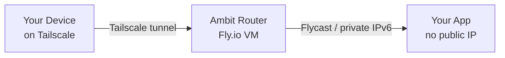

# Ambit CLI

## What Ambit Is

Ambit deploys apps to the cloud in a way that makes them completely unreachable from the public internet. Only devices enrolled in the user's private Tailscale network can connect to them. From the outside world's perspective, the app does not exist — there is no IP address to find, no port to scan.

This matters because putting a database, dashboard, or internal tool on the normal internet forces you to build login pages, configure firewalls, and harden the app against strangers. Ambit skips all of that. Access control is handled at the network level: if a device is on the Tailscale network, it can reach the app; if it isn't, the connection is refused before the app ever sees it.

Each private network you create is called an **ambit**. Every app deployed to it gets a human-readable address under that network's name — so `http://my-app.lab` means the `my-app` application on the `lab` ambit. These addresses work automatically for any device enrolled in the user's Tailscale account.

## Installation

If `ambit` is not already installed, run it directly via Nix:

```bash
npx @cardelli/ambit
```

## How It Works



Ambit creates a router on Fly.io that joins the user's Tailscale network and advertises the private IPv6 subnet for that ambit. It also sets up split DNS so that `*.<network>` queries resolve to the right app. Apps deployed with `ambit deploy` get a private Flycast address on the network and never receive a public IP.

## Prerequisites

- `flyctl` installed and authenticated (`fly auth login`)
- Tailscale installed and connected (`tailscale up`)
- Accept-routes enabled (`sudo tailscale set --accept-routes`)
- A Tailscale API access token (`tskey-api-...`) — create one at https://login.tailscale.com/admin/settings/keys

## Commands

### `ambit create <network>`

Creates a new private network. This is the first command to run when setting up a new ambit. It deploys a router on Fly.io, connects it to the user's Tailscale network, and configures split DNS so apps on the network are reachable by name.

```bash
ambit create lab
ambit create lab --org my-org --region sea
ambit create lab --self-approve
```

**Flags:**
- `--org <org>` — Fly.io organization slug
- `--region <region>` — Fly.io region (default: `iad`)
- `--api-key <key>` — Tailscale API access token (prompted interactively if omitted)
- `--tag <tag>` — Tailscale ACL tag for the router (default: `tag:ambit-<network>`)
- `--self-approve` — Approve subnet routes via Tailscale API instead of requiring autoApprovers in the ACL policy
- `-y, --yes` — Skip confirmation prompts
- `--json` — Output as JSON

**What it does:**
1. Validates Fly.io auth and the Tailscale API key
2. Checks that the tag (default `tag:ambit-<network>`, or custom via `--tag`) exists in Tailscale ACL tagOwners
3. Checks autoApprovers config (unless `--self-approve`)
4. Creates a Fly.io app on the custom network
5. Sets secrets: `TAILSCALE_API_TOKEN`, `NETWORK_NAME`, `TAILSCALE_TAGS`
6. Deploys the router container
7. Waits for the device to join the tailnet
8. Configures split DNS (`*.<network>` → router)
9. Enables accept-routes locally if possible

**Before running**, the user must add the router's tag in their Tailscale ACL settings at https://login.tailscale.com/admin/acls/visual/tags. The tag defaults to `tag:ambit-<network>` but can be overridden with `--tag`.

And optionally (or use `--self-approve` to skip this):
```json
"autoApprovers": { "routes": { "fdaa:X:XXXX::/48": ["tag:ambit-<network>"] } }
```

### `ambit deploy <app> --network <name>`

Deploys an app onto a private network. This is the safe alternative to `fly deploy`: it always passes `--no-public-ips` and `--flycast`, runs pre-flight checks on the fly.toml for dangerous settings, and audits the result to verify no public IPs were allocated.

There are three mutually exclusive deployment modes:

**Config mode** (default) — uses a local `fly.toml`:
```bash
ambit deploy my-app --network lab
ambit deploy my-app --network lab --config ./custom.toml
```

**Image mode** — deploys a Docker image without fly.toml:
```bash
ambit deploy my-app --network lab --image registry.fly.io/my-app:latest
ambit deploy my-app --network lab --image registry.fly.io/my-app:latest --main-port 3000
```

**Template mode** — fetches a template from a GitHub repository and deploys it:
```bash
ambit deploy my-browser --network lab --template ToxicPine/ambit-templates/chromatic
ambit deploy my-browser --network lab --template ToxicPine/ambit-templates/chromatic@v1.0
ambit deploy my-shell --network lab --template ToxicPine/ambit-templates/wetty
```

**Flags:**
- `--network <name>` — Target network (required)
- `--org <org>` — Fly.io organization
- `--region <region>` — Primary region
- `--config <path>` — Explicit path to fly.toml (config mode)
- `--image ` — Docker image to deploy (image mode)
- `--main-port <port>` — Internal port for HTTP service in image mode (default: 80, "none" to skip)
- `--template <ref>` — GitHub template reference (template mode)
- `-y, --yes` — Skip confirmation
- `--json` — Output as JSON

**Template reference format:**
```
owner/repo/path             Fetch from the default branch
owner/repo/path@tag         Fetch a tagged release
owner/repo/path@branch      Fetch a specific branch
owner/repo/path@commit      Fetch a specific commit
```

The template must contain a `fly.toml` (and typically a Dockerfile). The template is fetched from GitHub's tarball API, the target subdirectory is extracted, pre-flight scanned, and deployed. The temp directory is cleaned up automatically.

### `ambit list`

Lists all discovered routers across all networks.

```bash
ambit list
ambit list --org my-org --json
```

Shows: network name, app name, region, machine state, private IP, subnet, and Tailscale device status.

### `ambit status`

Shows detailed router status. Run without `--network` to see all routers, or with `--network` to focus on one.

```bash
ambit status
ambit status --network lab
```

Detailed view includes: machine state, SOCKS5 proxy address, Tailscale IP, online status, advertised routes, and split DNS config.

### `ambit destroy --network <name>`

Tears down a router and cleans up all associated resources. Apps deployed on the network are NOT deleted — only the router is removed. The user will need to manually remove ACL policy entries for the network tag.

```bash
ambit destroy --network lab
ambit destroy --network lab --yes
```

**What it does:**
1. Finds the router app for the network
2. Clears split DNS configuration
3. Removes the Tailscale device
4. Destroys the Fly.io app

### `ambit doctor`

Health check for the local environment and router infrastructure. Run this whenever something seems wrong — it checks the most common failure points and gives remediation hints.

```bash
ambit doctor
ambit doctor --network lab
```

**Checks:**
- Tailscale CLI installed
- Tailscale connected (BackendState = Running)
- Accept-routes enabled
- Router(s) exist and machines are running
- Router(s) visible in tailnet

## Templates

Ready-to-deploy templates are available at `ToxicPine/ambit-templates`:

| Template | Description |
|----------|-------------|
| `ToxicPine/ambit-templates/chromatic` | Headless Chrome exposing Chrome DevTools Protocol on port 9222 — for AI agents or scripts that need a browser on the private network. |
| `ToxicPine/ambit-templates/wetty` | A cloud devshell with a web terminal, persistent home directory, passwordless sudo, and auto start/stop. |
| `ToxicPine/ambit-templates/opencode` | A private OpenCode web workspace — Nix-based environment with persistent home and auto start/stop. |

```bash
ambit deploy my-browser --network lab --template ToxicPine/ambit-templates/chromatic
ambit deploy my-shell --network lab --template ToxicPine/ambit-templates/wetty
ambit deploy my-code --network lab --template ToxicPine/ambit-templates/opencode
```

## Common Workflows

### First-Time Setup
```bash
# 1. Add tag to Tailscale ACL policy in the web UI
# 2. Create the router
ambit create lab --self-approve

# 3. Deploy an app
ambit deploy my-app --network lab

# 4. App is now reachable as http://my-app.lab from any device on the tailnet

# 5. Invite people to your tailnet:
#    https://login.tailscale.com/admin/users
# 6. Control their access:
#    https://login.tailscale.com/admin/acls/visual/general-access-rules
```

### Deploy from a Template
```bash
ambit deploy my-browser --network lab --template ToxicPine/ambit-templates/chromatic
# → headless Chrome at my-browser.lab:9222, reachable via CDP
```

### Debugging Connectivity
```bash
ambit doctor --network lab    # Check all the common failure points
ambit status --network lab    # Detailed router state
```

### Tearing Down
```bash
ambit destroy --network lab
# Then remove from Tailscale ACL:
#   tagOwners: tag:ambit-lab
#   autoApprovers: routes for tag:ambit-lab
```

## Troubleshooting

| Symptom | Fix |
|---------|-----|
| "Tag not configured in tagOwners" | Add `"tag:ambit-<network>": ["autogroup:admin"]` to Tailscale ACL tagOwners. |
| "autoApprovers not configured" | Either configure autoApprovers in the ACL or re-run with `--self-approve`. |
| Router deployed but not reachable | Run `ambit doctor`. Check that accept-routes is enabled locally. |
| "Timeout waiting for device" | Check router logs. Most common cause: expired or invalid Tailscale API key. |
| Apps not resolving as `<app>.<network>` | Verify split DNS is configured: `ambit status --network <name>`. Check the router is online in the tailnet. |
| "Flyctl not found" | Install from https://fly.io/docs/flyctl/install/ |
